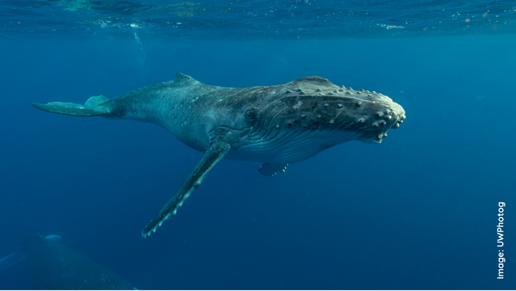
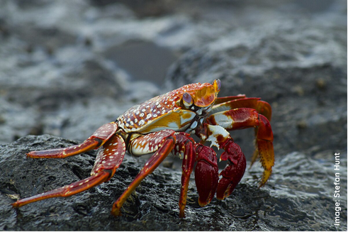

```{r setup, include=FALSE}

knitr::opts_chunk$set(echo = FALSE, warning = FALSE, message = FALSE, fig.align = "left")

library(tidyverse)
library(sf)
library(gt)

source("@_Region file.R")

table_nums <- captioner::captioner(prefix = "Table ")

table.ref <- function(x) stringr::str_extract(table_nums(x), "[^:]*")

models <- StrathE2E2::e2e_ls("Files/")

model <- StrathE2E2::e2e_read("Ascension_MA", "2010-2019-CNRM-ssp126", models.path = "Files")

Area <- read.csv(str_glue("Files/Ascension_MA/2010-2019-CNRM-ssp126/Param/event_timing_ASCENSION_MA_2010-2019-CNRM-ssp126.csv")) %>% 
  filter(str_detect(Description, "km2")) %>% 
  .$Value

Area
```

# Introduction {.unnumbered}

This document describes the configuration of StrathE2E for the Ascension Island off the South Mid-Atlantic Ridge and its parameterisation to enable stationary state fitting for both the baseline period (2010-2019) and future projections (2020-2069).
These represent contrasting periods of environmental conditions.

Volumetric and seabed habitat data define the physical configuration of the system.
We regard these as being fixed in time.
Similarly, we regard the physiological parameters of the ecology model as being fixed in time.
Some of these are set from external data.
The remainder are fitted, as detailed here.
Changes in the model performance between the different time periods therefore stem from the hydrodynamic, hydro-chemical and fishery driving data.
These are detailed in the ecological drivers and fishing fleet sections.

In the StrathE2E model all marine lifeforms are explicitly or implicitly accounted for, but aggregated into coarse groups or 'guilds' defined mainly by feeding characteristics and diet preferences (Figure \@ref(fig:guilds).
All state variables, except macrophytes, are expressed solely in terms of nitrogen mass.
For more information about the StrathE2E model check the [documentations](http://www.marineresourcemodelling.maths.strath.ac.uk/strathe2e/) available.

```{r guilds, echo=FALSE, fig.cap="Ecological guilds of the StrathE2E model (Heath, 2021).", out.width = '100%'}

```

> Department of Mathematics and Statistics, University of Strathclyde, Glasgow, UK, E-mail: [m.heath\@strath.ac.uk](mailto:m.heath@strath.ac.uk){.email}
>
> Oceanographic Institute, University of Sao Paulo, Brazil, E-mail: [juliapetroski\@usp.br](mailto:juliapetroski@usp.br){.email}
>
> The code written to support this parameterisation is available on [github](https://github.com/Jack-H-Laverick/MA.Ascension).

<br>

# Model Domain {.unnumbered}

```{r island, echo=FALSE, out.width = '100%'}

```

Ascension Island (7°56'S, 14°22'W) is a remote volcanic island, part of the British Overseas Territory of Saint Helena, Ascension, and Tristan da Cunha.
Is located approximately equidistant between Africa and South America, and about 1,300 km northwest of its nearest neighbor, St. Helena Island.
Since 2019, the island has been designeted as a Marine Protected Area (MPA) that encompasses its entire Exclusive Economic Zone (EEZ), covering 445,390 km².
Within this area, commercial fishing and mineral extraction activities are prohibited (Ascension Island Government, 2021).
Common coastal habitats such as coral reefs, mangroves, and seagrass beds are absent, and the inshore area is instead dominated by volcanic rocky substrates and a few beaches with coarse sand (Lubbock, 1980; La Bianca et al., 2018).
Beyond the island and its seamounts, more than 99.9% of the MPA consists of pelagic habitats - open ocean waters deeper than 500 meters to over 4,000 meters (Ascension MPA).

The model splits the domain into three zones: inshore/shallow, offshore/shallow, and offshore/deep (Figure \@ref(fig:overhang)).
The inshore/shallow zone covers waters shallower than 60 m or within 2.6 km from shore.
The offshore zone encompasses the remaining area of the model domain (Figure 2) and is further divided into a shallow and a deep layer.
The shallow layer represents water from the surface to 60 m depth, and shares a boundary with the inshore shallow zone.
The offshore/deep zone covers the same area as the offshore/shallow zone, but represents water between 60 m and 600 m deep.
There is a second internal boundary between the two offshore zones.

```{r overhang, echo=FALSE, fig.cap="The spatial structure of StrathE2E; Ocean volumes and seafloor habitats. StrathE2E is built around a simplified spatial structure which represents shelf seas. These spatial units are connected to each other and to boundaries as shown to the right. The volumes connected to each spatial component are highlighted in blue.", out.width = '100%'}
knitr::include_graphics("img/overhang.png")
```

The seafloor within the StrathE2E model can be classified into eight habitat types.
These include three sediment classes: fine (muddy, 1), medium (sandy, 2), and coarse (gravel, 3), with the fourth class (rock, 0) indicating the absence of soft sediment.
These sediment classes are defined in both the inshore/shallow and offshore/deep zones.

As of V.4, StrathE2E2 can represent an offshore "overhang" where open ocean does not contact the seafloor (Figure \@ref(fig:overhang)).
The perimeter of the offshore zone in the model domain is the edge of the MPA, with a "false bottom" (overhang) that exchanges with the deep sea.
By using the MPA to define the model domain, we accurately represent the protected area status of Ascension Island, which also corresponds to the Exclusive Economic Zone (EEZ).
The total area of the model is 447,888.73 km².

```{r domain, echo=FALSE, fig.cap="Map of the model domain. StrathE2E defines seabed sediment habitats as inshore (light gray) or offshore (dark gray). Within each zone, three sediment classes can be represented – fine (muddy, 1), medium (sandy, 2) and coarse (gravel, 3). A fourth class (rock, 0) represents an absence of soft sediment. In this model implementation the inshore and offshore were divided into  sandy sediment and rock habitat, where most of the model domain (>99.9) is overhang with a false seabed.", out.width = '100%'}

```

# Fixed Physical {.unnumbered}

## Background {.unnumbered}

#### Water column inshore/shallow and offshore/deep zone area proportions and layer thicknesses; seabed habitat area proportions and sediment properties: {.unnumbered}

The depth boundary between deep and shallow layers was determined using vertical diffusivity values from NEMO-MEDUSA [@yool13] and mixed layer depth from Globcolour (www.globcolour.info/).
The shallow-deep layer division was set at 60 m, with a bottom depth of 600 m for the deep layer.
The offshore zone then extends to the edge of the EEZ, but with a "false bottom" that exchanges with the deep sea (without seafloor).
In the coastal zone, the polygon is defined for areas shallower than 60 m or within 2.6 km of the coast.

#### Parameters for relationship between median grain size, sediment porosity and permeability. Permeability is used as the basis for estimating hydraulic conductivity which is a parameter in the representation of sediment processes in the model: {.unnumbered}

Porosity (proportion by volume of interstitial water) and permeability of each sediment habitat were derived from median grain sizes using empirically-based relationships.

$$log_{10}(porosity) = p_3 + p_4\left(\frac{1}{1+e^{(\frac{-log_{10}(D_{50})-p_1}{p_2})}}\right)$$ D~50~ = median grain size (mm); parameters p~1~ = -1.227, p~2~ = -0.270, p~3~ = -0.436, p~4~ = 0.366 [@heath21]

$$permeability = 10^{p_5}∙D_{50}^{*p_6}$$

where D~50~\* = 0.11 ≤ D~50~ ≤ 0.50 p~5~ = -9.213, p~6~ = 4.615 [@heath15].

These relationships are coded into the StrathE2E2 R-package with the parameters in the csv setup file for the Saint Helena model.
The parameters are probably a reasonable starting point for any future model of a new region.
Derivation of the parameters is described in the following text sub-sections.

#### Parameters for in-built relationship between sediment mud content, and slowly degrading (refractory) organic nitrogen content of seabed sediments (see description in this document): {.unnumbered}

Values for each sediment type derived from parameterised relationships between total organic nitrogen content of sediments (TON%, percent by weight), mud content (mud%, percent by weight) and median grain size (D~50~, mm).

$$mud\% = 10^{p_7}∙𝐷_{50}^{𝑝_8}$$ p~7~ = 0.657, p~8~ = -0.800

$$TON\% = 10^{𝑝_9}∙mud\%^{𝑝_{10}}$$ p~9~ = -1.965, p~10~ = 0.590

Proportion of TON estimated to be refractory = 0.9

These relationships, along with their parameters, are documented in the North Sea implementation of the StrathE2E2 package [@heath21].
While there may be regional variations, these relationships serve as a reasonable starting point for the Ascension Island implementation.
The StrathE2E2 R-package encodes these relationships, with the parameters specified in the CSV setup file.
Derivation of the parameters is described in the following sub-sections.

## Model area proportions {.unnumbered}

```{r area_proportions_cap}

tab_area_proportions_cap <- table_nums(name = "tab_area_proportions", 
    caption = stringr::str_glue("Area-proportions of the inshore and offshore zones and the thicknesses of the                                        water column layers. The sea surface area of the model domain is an estimated                                         {Area} km^2^."))
```

`r table_nums("tab_area_proportions")`

```{r area_proportions}

data_frame(Property = c("Sea-surface area proportion",
                        "Upper layer thickness (m)",
                        "Lower layer thickness (m)"),
           `Inshore/shallow` = c(model[["data"]][["physical.parameters"]][["x_shallowprop"]], 
                                 model[["data"]][["physical.parameters"]][["si_depth"]], 
                                 NA),
           `Offshore/deep` = c(1 - model[["data"]][["physical.parameters"]][["x_shallowprop"]], 
                               model[["data"]][["physical.parameters"]][["so_depth"]], 
                               model[["data"]][["physical.parameters"]][["d_depth"]])) %>% 
  gt() %>% 
  fmt_number(columns = c("Offshore/deep", "Inshore/shallow"), decimals = 4, use_seps = FALSE)


```

```{r habitat_proportions_cap}

tab_habitat_proportions_cap <- table_nums(name = "tab_habitat_proportions", 
    caption = stringr::str_glue("Area proportions and other characteristics of the seabed habitat classes defined in the model by depth, rock or sediment type. The sea surface area of the model domain is an estimated {Area} km^2^. Grain size is the median in mm, Permeability in units of m^2^, nitrogen content in %dw."))
```

`r table_nums("tab_habitat_proportions")`

```{r habitat_proportions}

physical <- read.csv(str_glue("Files/Ascension_MA/2010-2019-CNRM-ssp126/Param/physical_parameters_ASCENSION.csv"))
  
proportions <- which(str_detect(physical$Description, "Area_proportion"))
porosity <- which(str_detect(physical$Description, "Defined_porosity"))
permeability <- which(str_detect(physical$Description, "Defined_permeability"))
nitrogen <- which(str_detect(physical$Description, "Defined_total_N"))
grain <- which(str_detect(physical$Description, "grain_size"))

depth_vector <- c(rep(c("Shallow"), each = 4), rep(c("Deep"), each = 5))
zone_vector <- c(rep(c("Inshore"), each = 4), rep(c("Offshore"), each = 5))

data_frame(Habitat = c("S0", "S1", "S2", "S3", "D0", "D1", "D2", "D3", "OV"),
           Depth = depth_vector,
           Zone = zone_vector,
           Sediment = rep(c("None (Rock)", "Fine", "Medium", "Coarse", "None (Rock)", "Fine", "Medium", "Coarse", "Overhang")),
           `Area Proportion` = physical$Value[proportions],
           `Grain size` = c(0, physical$Value[grain[1:3]], 0, physical$Value[grain[4:6]], NA),
           Porosity = c(NA, physical$Value[porosity[1:3]], NA, physical$Value[porosity[4:6]], NA),
           Permeability = c(NA, physical$Value[permeability[1:3]], NA, physical$Value[permeability[4:6]], NA),
           `Nitrogen content` = c(NA, physical$Value[nitrogen[1:3]], NA, physical$Value[nitrogen[4:6]], NA)) %>% 
  group_by(Zone, Depth) %>% 
  gt() %>% 
  fmt_number(columns = c("Area Proportion", "Grain size", "Porosity", "Permeability", "Nitrogen content"), 
                         decimals = 4, use_seps = FALSE) %>% 
  cols_align(align = 'center',
             columns = vars(`Area Proportion`, `Grain size`, Porosity, Permeability, `Nitrogen content`)) %>% 
  tab_options(row_group.background.color = "whitesmoke")


```

## Daily disturbance rates {.unnumbered}

[Copied from SBS, still needs compilation for Ascension?]

To calculate the natural disturbance rate, we needed depth-averaged current speeds (including tidal influence) and wave data.
We used data products from Copernicus Marine Data; however, only surface tide components were available instead of depth-averaged values, and the depth-averaged current speeds did not include tides.
Therefore, we approximated the influence of tides on the depth profile by assuming that the extra surface speed diminishes with depth at a certain decay rate.
We employed a rough approximation for non-stratification and a flat bottom from the National Oceanography Centre (NOC).
The equation assumes a constant speed in the upper half of the water column and attenuation in the lower half due to bottom friction, with speed decaying to zero at the bottom.

$$U_{} = U_{\text{current}} + \frac{U_{\text{tides }}}{1.07}$$ $$V_{} = V_{\text{current}} + \frac{V_{\text{tides }}}{1.07}$$

We used the Copernicus toolbox for subsetting the specific variables, the SBS domain, and the desired period via Command Line Interface (CLI), then post-processed the data in R.
Since the Copernicus Marine Data Store only hosts recent data for public download, we used data from 2022, the oldest full annual cycle available with all three variables.
Details about the products used below.

Waves: We used the Global Ocean Waves Analysis product (DOI: 10.48670/moi-00017) with a 1/12-degree resolution.
The parameters used every 3 hours were: significant wave height, mean wave direction, and primary swell wave period.
Specific variables included Sea surface wave significant height (VHM0, m), Sea surface wave direction (VMDR, °), and Sea surface primary swell wave mean period (VTM01SW1, s).

Currents: We used the Global Ocean Physics Analysis and Forecast product (DOI: 10.48670/moi-00016) with a 1/12-degree resolution.
The 6-hourly parameters used were Eastward sea water velocity (uo, m/s) and Northward sea water velocity (vo, m/s).

Tides: We used the Global Ocean Physics Analysis and Forecast product (DOI: 10.48670/moi-00016) with a 1/12-degree resolution.
The 1-hourly parameters used were Surface sea water x velocity due to tide (utide, m/s) and Surface sea water y velocity due to tide (vtide, m/s).

Even though the grid is shared, there were coastal cells with currents but missing data for waves and tides.
We interpolated missing coastal cells using the Voronoi tessellation method (nearest neighbor).
We also interpolated the depth-averaged currents and waves to match the hourly timestep of the tides using the `approx` function.

We combined all data into a single dataset and applied functions from the `bedshear` package to calculate bed shear stress for the six habitat types.

## Sediment porosity {.unnumbered}

Log-transformed porosity has been shown to have a sigmoidal relationship with log~10~(median grain size) (D~50~, mm) [@wilson18]:

$$log_{10}(porosity) = p_3 + p_4\left(\frac{1}{1+e^{(\frac{-log_{10}(D_{50})-p_1}{p_2})}}\right)$$

We use this relationship to calculate porosity for seabed sediments in the Ascension Island (`r table.ref("tab_habitat_proportions")`), using an alternative parameterisation to Wilson [@pace21].
This alternative set of parameters extends the relationship to fine, muddy sediments (`r table.ref("tab_porosity")`).

```{r porosity_cap}

tab_porosity_cap <- table_nums(name = "tab_porosity", 
    caption = "The four parameters for the function relating sediment porosity to median grain size. From Pace et al. (in review)")
```

`r table_nums("tab_porosity")`

```{r tab_porosity}

d50_to_pore <- which(str_detect(physical$Description, "porosity_and_grainsize"))

data_frame(Parameter = paste0("P", 1:4),
           `Fitted value` = physical$Value[d50_to_pore]) %>%
  pivot_wider(names_from = Parameter, values_from = `Fitted value`) %>% 
  gt()

```

## Hydraulic conductivity {.unnumbered}

Hydraulic conductivity (H, m.s^-1^) represents the ease with which fluids flow through the particle grain matrix.
The related term 'permeability' (m^-2^) is a measure of the connectedness of the fluid filled void spaces between the particle grains.
Permeability is a function only of the sediment matrix, whilst conductivity is a function of both the sediment and the permeating fluid, in particular the fluid viscosity and density.
Hydraulic conductivity is related to permeability by:

$$H = Permeability∙fluid\;density∙\frac{𝑔}{dynamic\;viscosity}$$ where: seawater density = 1027 kg.m^-3^ at salinity 35 and temperature 10°C; seawater dynamic viscosity = 1.48 x 10^-3^ kg.m^-1^.s^-1^ at salinity 35 and temperature 10°C; g = acceleration due to gravity = 9.8 m.s^-1^

Hence, $H = Permeability · 6.8004·10^6$ (m.s^-1^ at salinity 35 and temperature 10°C)

Whole sediment permeability can be related to the proportion of sediment classed as mud (D~50~ \< 62 μm) [@pace21].
In this model implementation, this relationship is utilized for internal calculations.

## Sediment organic nitrogen content {.unnumbered}

The magnitude of the static (refactory) organic nitrogen detritus pool in each sediment type is a required input to the model.
The code includes an option to impute values from empirical relationships between total organic nitrogen (TON) and mud content, and between mud content and median grain size.
This relationship has been documented in the North Sea implementation [@heath21].
For the Ascension Island implementation, the total nitrogen content is internally calculated and based on that relationship.

# Fixed biological {.unnumbered}

## Configuration parameters {.unnumbered}

### Assimilation efficiencies for each living guild in the model. {.unnumbered}

Fixed parameters defining the proportion of ingested mass of food that contributes to new body tissue, after subtracting defecation and the metabolic costs of digestion and synthesis [@heath12].

### Biomass loss rates due to temperature-dependent metabolism for each living resource guild. {.unnumbered}

Proportion of biomass lost to ammonia per day due to non-feeding related metabolism at a given reference temperature.
Rates for individual guilds broadly related to typical body mass of representative species.
Temperature dependency following a Q~10~ function.

### Q~10~ values for temperature dependent processes, and the Q~10~ reference temperature. {.unnumbered}

Separate Q10 values for autotrophic uptake of nutrient, heterotrophic feeding, and heterotrophic metabolism based on literature data.

### Light intensity required to saturate autotrophic nutrient uptake. {.unnumbered}

Light saturation intensity for nutrient uptake cannot be treated as a fitted value since it is confounded with other uptake parameters.
Value estimated from survey of laboratory experiments.

### Annual weight specific fecundities of planktivorous and demersal fish guilds and the two benthos guilds in the model (suspension/deposit feeders and carnivore/scavenge feeders). {.unnumbered}

Guild-level values derived by surveying the literature.

### Harvestable biomass density threshold for each resource guild. {.unnumbered}

The living resource guilds in the model represent a mixture of harvestable and non-harvestable species, especially the invertebrate guilds.
The density threshold parameter sets a limit for the guild biomass below which the harvestable species are assumed to be exhausted.
Values set from analysis of trawl, plankton and benthos survey species biomass compositions.

### Minimum inedible biomass of carnivorous zooplankton. {.unnumbered}

The carnivorous zooplankton guild is a key component of the food web, predated on by all the fish and top-predators.
However it represents an extremely diverse range of fauna many of which are not edible in significant quantities by the guild predators, e.g. scyphomedusae.
A minimum edible threshold is set to ensure that the guild as a whole cannot be extirpated by predation.
The value is a rough estimate of scyphomedusae biomass.

## Event timing parameters (not fitted) {.unnumbered}

### Spawning and recruitment start and end dates for fish and benthos {.unnumbered}

We gathered the spawning and recruitment periods for each guild based on literature regarding the main species, described below.
In the model the annual weight-specific fecundity is assumed to be shed uniformly between the start and end dates of spawning.
The annual cohort of larvae/juveniles of each fish and benthos guild is assumed to recruit to the settled stage at a uniform daily rate between the start and end dates.

#### Planktivorous {.unnumbered}

We did not find specific data on the reproductive period of planktivorous species on Ascension Island.
Therefore, we inferred a spawning period during the austral spring and summer, with recruitment occurring in autumn and winter, based on data from small pelagics at the Saint Peter and Saint Paul Rocks (see SPSP model implementation)- primarily flyingfish (*Cypselurus cyanopterus*), which is ecologically important on Ascension as it forms the principal diet of both boobies and frigatebirds (Oppel et al., 2015).
The spawning period for the planktivorous guild was set from December 1st to March 31st, with recruitment from April 1st to June 30th.

#### Demersal {.unnumbered}

The reproductive period for the demersal guild was determined based on the spawning patterns of the rock hind grouper (*Epinephelus adscensionis*), a common fish in Ascension's nearshore waters known for its high abundance and significant cultural and subsistence value (Orrel et al., 2024).
Most species within the grouper subfamily Epinephelinae form spawning aggregations and spawn over extended periods during the winter and spring (Edwards, 1990).
On Ascension Island, the grouper spawning period occurs between June and November, peaking in August (austral winter) (Edwards, 1990; Ascension Island Government, 2016; Nolan et al., 2017).
In the absence of specific recruitment data, we set the recruitment period to begin 90 days after the conclusion of spawning, lasting for 150 days.

#### Carnivorous and scavengers benthos {.unnumbered}

The spawning period of CS benthos such as lobster on Ascension Island remains insufficiently documented.
Tropical lobsters within the Panulirus genus have broad spawning periods spread throughout the year and varying in duration (Ascension Island Government, 2015).
Reports from Saint Helena Island, a neighboring island, suggest that lobsters enter early reproductive stages from October 1st to December 31st, with a fisheries closure from January through March to protect lobsters in advanced reproductive stages, specifically the brown spiny lobster (*Panulirus echinatus*) and the stump lobster (*Scyllarides obtusus*) (St Helena, 2012; 2022).

Based on this information, the spawning period for the CS benthos guild was established from January 1st to March 31st, with the recruitment period from April 1st to June 30th.
In the absence of specific recruitment data, we assumed recruitment would begin 30 days after the end of the spawning period, continuing for 120 days.

#### Filter and deposit benthos {.unnumbered}

Research on the reproductive activities of FD benthos in Ascension Island is limited.
We adopted the same spawning and recruitment periods used for the DF benthos guild in the South Brazil Bight implementation (See X source): spawning period from September 1st to February 1st and recruitment from August 1st to January 1st.

```{r event_cap}

tab_event_cap <- table_nums(name = "tab_event", 
    caption = "Biological event timing parameters, constant across the time periods. The data are processed in the model setup to calculate the immigration flux parameters needed in the ecology model. Spawning and recruitment durations were established assuming a month with 30 days.")
```

`r table_nums("tab_event")`

```{r tab_migrant, fig.cap = tab_event_cap}

data_frame(Parameter = model[["data"]][["biological.events"]][["Description"]] %>% 
                        str_replace_all("_", " "),
           Value = model[["data"]][["biological.events"]][["Value"]]) %>% 
  .[1:16,] %>% 
  gt() %>%
  fmt_number(
    decimals = 0,
    use_seps = FALSE
  )

```

### Extra-domain stock biomass of migratory, and the proportion invading the domain each year. Start and end dates for the annual invasion, and start and end dates for the emigration. (see description below). {.unnumbered}

The migratory fishes in the region are part of a broader Atlantic stock and perform transatlantic movements, utilizing multiple spawning grounds.
Key migratory species making seasonal transits through Ascension waters include skipjack tuna (*Katsuwonus pelamis*), bigeye tuna (*Thunnus obesus*), yellowfin tuna (*Thunnus albacares*), swordfish (*Xiphias gladius*) along with other tuna-like species and sharks.
The data on the biomass of these migratory fish stocks, the proportion entering the Ascension Island EEZ, and the timing of their migrations is detailed below.

We assumed that there is no feedback between fishing and environmental conditions and the biomass and migration patterns.
In this version of StrathE2E the timing of immigration and emigration, and the mass influx across the ocean boundary during the annual immigration phase are treated as period-specific external driving data.

The model setup code calculates the parameters which are needed in the ecology model.
These are the only fixed (i.e. non-fitted) ecology model parameters which are period-specific.

```{r tuna, echo=FALSE, out.width = '100%'}

```

## Event timing parameters (fitted) {.unnumbered}

Tunas that forage around Ascension Island probably migrate to other areas to breed (Richardson et al., 2018).
Bigeye and yellowfin tuna primarily spawn in tropical waters, such as the Gulf of Guinea and the Gulf of Mexico, during the summer (Carleton et al., 2010).
Due to the highly migratory nature of tunas, assessment of local population size and trends is challenging (Ascension Island Government, 2016).
However, tagging studies have indicated local site fidelity of yellowfin tuna, with extended periods of residency around oceanic islands (Ascension Island Government, 2016; Richardson et al., 2018).
Tagging of bigeye tuna around seamounts has also suggested some degree of site fidelity, with at least short-term residency around these features (Ascension Island Government, 2016).
Atlantic blue marlin (*Makaira nigricans*) and Atlantic sailfish (*Istiophorus albicans*) have been tagged and tracked near Ascension as well, where tend to disperse out of the EEZ over several weeks, migrating to destinations including Cape Verde, the Gulf of Guinea, and the central North Atlantic (Ascension Island Marine Protected Area, 2019).

We utilized outputs from the SEAPODYM model, employed to characterize the movement dynamics of two tuna species in the Atlantic Ocean, as part of research conducted within the Mission Atlantic project [Merillet et al.
X (SOURCE)].
These outputs are based on the same four climate projections derived from NEMO-ERSEM physical outputs used in the StrathE2E driving data (see section X).
The projections are driven by two SSPs (SSP3-7.0 and SSP1-2.6) and two CMIP6 models (CNRM-CM6-1-HR and GFDL-ESM4).
Skipjack tuna (*Katsuwonus pelamis*) and albacore tuna (*Thunnus alalunga*) were modeled using SEAPODYM-MASS, an age-structured dynamic population model that accounts for prey availability.
Historical data were provided from 1990 to 2014, along with projections from 2015 to 2070, on a monthly basis and averaged across the Ascension model domain.
Data included biomass estimates for each SSP, model, and total stock biomass in the Atlantic.
To establish the baseline period from 2010-2019, historical data from 2010–2014 were combined with projections from 2015–2019.
The remaining time series were divided into decadal intervals from 2020–2029 to 2060–2069 for each of the four climate projections.

To identify the start and end days for annual immigration and emigration periods, we interpolated data to obtain daily values averaged by decade for each projection.
To synchronize with the StrathE2E annual cycle, each month was standardized to 30 days.
Seasonal cycles for each decade and projections were extracted using the decompose function in R, excluding trends and random components - for more information check the [function documentation](https://www.rdocumentation.org/packages/stats/versions/3.6.2/topics/decompose/).
Immigration was defined as the period during which biomass increased from the 20th to the 80th percentile, while emigration was the period during which biomass decreased from the 80th to the 20th percentile.

```{r migration, echo=FALSE, fig.cap = "Seasonal component of migratory fish biomass derived from SEAPODYM model outputs. Points A to D indicate the start and end dates of immigration and emigration for each decade (2010–2019 to 2060–2069), under two climate scenarios (SSP1-2.6 and SSP3-7.0) and two forcing models (CNRM and GFDL).", out.width='400%'}

```

As the migratory guild in Ascension Island includes species beyond skipjack and albacore tunas, we utilized SEAPODYM outputs to parameterize the local biomass.
This was done using a scaling factor to account for the multi-species migratory biomass from the Atlantic, since local stock data are unavailable.
In addition to skipjack and albacore, we considered 16 other species contributing to migratory stocks in the Atlantic that may enter Ascension EEZ, including: wahoo (*Acanthocybium solandri*), frigate tuna (*Auxis thazard*), Galapagos shark (*Carcharhinus galapagensis*), common dolphinfish (*Coryphaena hippurus*), Atlantic sailfish (*Istiophorus albicans*), shortfin mako (*Isurus oxyrinchus*), white marlin (*Kajikia albida*), blue marlin (*Makaira nigricans*), blue shark (*Prionace glauca*), Atlantic bonito (*Sarda sarda*), smooth hammerhead (*Sphyrna zygaena*), yellowfin tuna (*Thunnus albacares*), southern bluefin tuna (*Thunnus maccoyii*), bigeye tuna (*Thunnus obesus*), Atlantic bluefin tuna (*Thunnus thynnus*), and swordfish (*Xiphias gladius*).

These migratory fish stocks in the Atlantic are managed under the International Convention for the Conservation of Atlantic Tunas (ICCAT), which relies on a consensus-driven decision-making process among member nations.
Biomass estimates for this study were derived from Sea Around Us (SAU) stock assessments, which utilize ICCAT data and the CMSY method (Pauly et al., 2020; see www.seaaroundus.org/cmsy-method for details).
These estimates covered the period from 2010 to 2018, and we used the averaged values for our calculations.
The combined biomass of the 18 key stocks in the Atlantic, which may enter the Ascension EEZ, totaled 5,503,844.45 tons.
This was treated as the ‘global’ stock biomass of migratory fish, with a portion assumed to enter the model domain in all decades and projections.

The scaling factor was derived by dividing this global biomass by the skipjack and albacore stocks provided by SEAPODYM.
This factor was then applied to local skipjack and albacore biomass from SEAPODYM to estimate the total migratory biomass for Ascension Island, averaged by decade, model, and SSP.
To quantify the proportion of Atlantic migratory biomass entering the model domain annually, we divided the scaled local biomass by the Atlantic migratory biomass.
To estimate the proportion of peak biomass that remained within the model domain without emigrating, we extracted the maximum and minimum values from the seasonal cycle.

Using these results, we derived the necessary parameters for lines 17–26 in the event_timing_ASCENSION\_\*.csv files, for each decade and the four climate projections.

```{r tab_migrant_cap}

tab_migrantb_cap <- table_nums(name = "tab_migrantb", 
    caption = "Biological event timing parameters related to migratory fish constant across the time periods and climate projections")
```

`r table_nums("tab_migrantb")`

```{r tab_migrant_b, fig.cap = tab_migrantb_cap}

data_frame(Parameter = model[["data"]][["biological.events"]][["Description"]] %>% 
                        str_replace_all("_", " "),
           Value = model[["data"]][["biological.events"]][["Value"]]) %>% 
  .[17:20,] %>% 
  gt() %>%
  fmt_number(
    decimals = 3,
    use_seps = FALSE
  )
```

```{r migratory_baseline_cap}

migratory_baseline_cap <- table_nums(name = "migratory_baseline_cap", 
    caption = "Biological event timing parameters related to migratory fish for the baseline period (2010-2019) across the four climate projections.")
```

`r table_nums("migratory_baseline_cap")`

```{r migratory_baseline, fig.cap = migratory_baseline_cap}
migratory_fish_data <- data.frame(
  Parameter = c(
    "Propn of ocean popn entering domain each year",
    "Immigration start day",
    "Immigration end day",
    "Propn of peak popn in model domain which remains and does not emigrate",
    "Emigration start day",
    "Emigration end day"),
  `SSP1-CNRM` = c("0.01272", "203", "342", "0.9311", "55", "132"),
  `SSP3-CNRM` = c("0.01299", "207", "348", "0.9197", "61", "136"),
  `SSP1-GFDL` = c("0.01320", "260", "342", "0.8930", "55", "189"),
  `SSP3-GFDL` = c("0.01335", "239", "332", "0.8935", "45", "143"),
  check.names = FALSE)

migratory_fish_data %>%
  gt() %>%
  cols_align(align = "left", columns = vars(Parameter)) %>%
  cols_align(align = "center", columns = vars(`SSP1-CNRM`, `SSP3-CNRM`, `SSP1-GFDL`, `SSP3-GFDL`)) %>%
  cols_width(Parameter ~ px(220)) %>%
  tab_options(table.font.size = 15, table.align = "center")
```

# Ecological drivers {.unnumbered}

Monthly resolution time-varying physical and chemical driving parameters for the model were derived from a variety of sources:

-   Temperature, vertical mixing coefficients, volume fluxes, and boundary nutrient, detritus and phytoplankton concentrations from outputs of an ensemble of NEMO-ERSEM coupled hydro-geochemical model runs with a 2015 historical/future split CITE YURI XXX.
-   Surface shortwave radiation from CMIP6 used to force the NEMO-ERSEM coupled hydro-geochemical runs mentioned above.
-   Freshwater volume outflows from CMIP6 used to force the NEMO-ERSEM coupled hydro-geochemical runs mentioned above.
-   River nitrate and ammonia concentrations taken from the IMAGE model to force the NEMO-ERSEM coupled hydro-geochemical runs mentioned above.
-   Atmospheric deposition of nitrate and ammonia from ISIMIP3a ([Inter-Sectoral Impact Model Intercomparison Project](https://data.isimip.org/10.48364/ISIMIP.759077.2); [@yang22]) with SSP projects from ISIMIP3b used to force the NEMO-ERSEM coupled hydro-geochemical runs mentioned above.
-   Remote sensing data products on Suspended Particulate Matter (Globcolour L3b; <ftp://ftp.hermes.acri.fr/GLOB/merged/month/>).
-   Wave height, period, and direction from the ERA-5 reanalysis monthly means accessed through [CDS](https://cds.climate.copernicus.eu/cdsapp#!/dataset/10.24381/cds.f17050d7?tab=overview) for 1980-2021 [@Hersbach19].

Details of how these data were processed are given below, supported by the [nemomedusR](https://jack-h-laverick.github.io/nemoRsem/) and [MiMeMo.tools](https://jack-h-laverick.github.io/MiMeMo.tools/) packages.

### NEMO-ERSEM ensemble: {.unnumbered}

Four different NEMO-ERSEM runs were used to parameterise different versions of the Ascension Island implementation of StrathE2E.
These four runs are a 2x2 factorial cross of two future projected scenarios (SSP126 and SSP370) with a historical hindcast from 2015, and forcing by two atmospheric models (CNRM and GFDL).
In the following sections model output was processed for a 2010-2019 baseline period, and then decadal projections from 2020-2029 until 2060-2069.

### Vertical mixing coefficients between the model layers: {.unnumbered}

Vertical diffusivity from the NEMO-ERSEM coupled hydro-geochemical model output was interpolated for each grid cell at the `r SDepth`m boundary depth between the shallow and deep layers of the offshore zone, and the `r DDepth`m boundary at the deep sea overhang.
These values were summarised as monthly averages into period-specific climatological annual cycles of data for decadal periods for all combinations of SSPs and forcings.

### Monthly averaged temperatures for each water column layer: {.unnumbered}

Derived by monthly averaging values at grid points within the inshore and vertical layers of the offshore zones from the NEMO-ERSEM coupled hydro-geochemical model output, weighted by grid point volumes.
Values were summarised into period-specific climatological annual cycles of data.

### Monthly averaged suspended particulate matter (SPM) concentrations (mg.m^-3^) in the shallow zone and the deep zone upper layer: {.unnumbered}

Monthly averaged values of inorganic suspended particulate matter in sea water are available from the Globcolour project, starting from September 1997.
These data are derived from satellite observations using the algorithm of Gohin [-@gohin11].
Data were downloaded from the ftp server (<ftp://ftp.hermes.acri.fr/GLOB/merged/month/>).
We summarised these values as zonal statistics for the model domain to acquire a climatological annual cycle of data for the 2010-2019 simulation period only.

### Monthly average light attenuation coefficients for the inshore and offshore surface layers: {.unnumbered}

Light attenuation in open water was parameterised from a linear relationship between the light attenuation coefficient and suspended particulate matter concentration (SPM) (Devlin et al., 2008).

### Monthly averaged daily integrated irradiance at the sea surface (E.m^-2^.d^-1^): {.unnumbered}

Derived from HadGEM2-ES model output [@jones11] which forces the NEMO-ERSEM model run used throughout our implementation.
Monthly mean values were summarised into climatological annual cycles of data for decadal periods and NEMO-ERSEM ensembles.

### Monthly averaged daily atmospheric deposition rates of oxidised and reduced nitrogen onto the sea surface in the shallow and deep zones (mMN.m^-2^.d^-1^): {.unnumbered}

Sourced from the "histsoc" files for a 1901 - 2021 hindcast as monthly averages [@yang22], available from [CDS](https://cds.climate.copernicus.eu/cdsapp#!/dataset/10.24381/cds.f17050d7?tab=overview).
Monthly values were summarised into climatological annual cycles of monthly oxidised and reduced nitrogen deposition rates extracted for 2010-2019.
ISIMIPb Projections for SSP126 and SSP370 were processed in the same way for decadal periods up to and including the 2060s.

### Monthly averaged, freshwater river inflow rates (expressed as a daily proportion of the receiving layer volume), and concentrations of oxidised and reduced dissolved inorganic nitrogen in the inflowing river waters (mMN.m^-3^): {.unnumbered}

Freshwater inflow derived from HadGEM2-ES model output [@jones11] which forces the NEMO-MEDUSA model run used throughout our implementation.
Monthly values were summaries into a climatological annual cycle of data for both the 2010-2019 and 2040-2049 periods.

[old information]

### Volume fluxes into the model domain across open sea boundaries, and from the upper layer of the offshore/deep zone into the inshore/shallow zone, expressed as proportions of the receiving layer volume per day: {.unnumbered}

Monthly averaged daily inflow and outflow volume fluxes derived by integrating daily mean velocities directed perpendicular to transects along the model domain boundary at grid points in each depth layer along transects through outputs from the NEMO-ERSEM coupled hydro-geochemical model output.
Monthly averaged daily inflow volume fluxes then divided by the volume of the receiving layer in the model domain to estimate a daily flushing rate.

### Mean concentrations of nitrate, ammonia, phytoplankton and suspended detritus (mMN.m^-3^), in adjacent ocean waters inflowing to the offshore/deep zone upper layer, adjacent ocean waters inflowing to the offshore/deep zone lower layer, and adjacent shelf waters inflowing to the inshore/shallow zone: {.unnumbered}

NEMO-ERSEM outputs included nitrate, ammonia, phytoplankton and suspended detritus.
We calculated the depth-averaged concentrations for pixels within the shallow and deep layers of StrathE2E.
We then sampled the pixels using the same transects around the model domain as for sampling volume fluxes.
Only transects where water flowed into the model domain were sampled, and the average concentration of inflowing waters for target variables was calculated weighting by the flow rate across a transect and the cross-sectional area represented by a transect (average depth and length).
Concentrations were then averaged into climatological annual cycles.
The flow weighted averaging of concentrations was calculated on the 5-day NEMO-ERSEM timestep, before averaging to a monthly climatology of concentrations.

# Fishing fleet {.unnumbered}

## Background {.unnumbered}

The key configuration data for the fishing fleet model are the definitions of the gears in terms of their power with respect to each of the harvestable resource guilds, discards and bycatch rates, processing-at-sea rates, and seabed abrasion rates.
These can be regarded as static parameters for each fleet.
Fleets were defined based on available data from databases and literature, with some grouped according to similarities and potential Ascension Island EEZ policy and management scenarios.
Species were categorized into the commercial guilds based on ecological properties using information from databases such as FishBase (Froese and Pauly 1999; <https://www.fishbase.se/>).

Historically, Ascension faced considerable fishing pressure, primarily from foreign longline fleets targeting pelagic species such as tuna and sharks (Reeves and Laptikhovsky, 2014).
Although commercial longlining has declined, recreational and subsistence fishing remain popular activities within the Territory, providing a crucial source of food for the community (Ascension Island Government, 2015).

After prohibitions, commercial fisheries were reopened in 2010, prohibited again across the entire EEZ in 2014, and then partially reopened in 2015 under updated regulations that allowed fishing in the northern half of the EEZ while the southern half remained a closed area within 50 nautical miles of the island (Ascension Island Government, 2018; Rowlands et al., 2019).
However, between 2015 and 2018, the uptake of licenses was minimal, with only one or two licenses issued annually (Ascension Island Government, 2019).
In 2019, the Ascension Island MPA was designated, covering 100% of Ascension's EEZ, making it one of the largest MPAs in the world.
The MPA prohibits fishing beyond 12 nautical miles from the island and bans large-scale commercial fishing throughout its 443,000 km² area, which includes Ascension's three shallow water seamounts (Ascension Island Government, 2021).

Commercial longlining has been licensed in the Ascension Island EEZ since 1988, mainly with Taiwanese and Japanese and others foreign-flagged vessels targeting bigeye tuna (*Thunnus obesus*), yellowfin tuna (*Thunnus albacares*), swordfish (*Xiphias gladius*), blue marlin (*Makaira nigricans*), and sharks (Irving, 2015; Ascension Island Government, 2019).

In addition to the licensed and regulated fishery, illegal, unreported, and unregulated (IUU) fishing for tuna and other species in the Atlantic is a concern, with some vessels potentially crossing the Ascensio EEZ. Satellite surveillance, coordinated by the Blue Belt Surveillance and Intelligence Hub in the UK, is used to detect such illegal activities (The Fisheries Conservation and Management Ordinance, 2015).
For the baseline period, we included potential fishing catches from purse-seine fleets, primarily targeting yellowfin and other tunas.

```{r shark, echo=FALSE, out.width = '100%'}

```

On a smaller scale, subsistence and recreational fishing are practiced for the local community.
Fishing methods include mainly handline, but also rod and line and spearfishing (Ascension Island Government, 2019).
In the sublittoral zone, these small-scale shore-based and vessel-based angling and spearfishing target reef fish such as rock hind (*Epinephelus ascensionis*), spotted moray (*Gymnothorax moringa*), and glasseye snapper (*Heteropriacanthus cruentatus*) (Ascension Island Government, 2015).
The recreational fishery for spiny lobsters (*Panulirus echinatus*) is highly valued but remains unquantified, posing a significant threat to local stocks (Ascension Island Government, 2015b).
Additionally, common octopuses (*Octopus occidentalis*) are caught in the local fishery and used as bait (Ascension Island Inshore Fisheries Strategy, 2022).

Based on this information, we grouped the following fleets in the fishing model: commercial purse-seine, longlines, and otter trawl, along with inshore artisanal handlines and hand-gathering and pots.
IUU purse-seine and longline fleets were included in the baseline scenario without specific values to simulate their potential impact.

Details regarding the sources used for landings, discards, bycatch, effort and other fishing data compilation is described below.

```{r fleets, echo=FALSE, fig.cap="Fishing fleets defined for the StrathE2E Ascension Island EEZ model, their operational descriptions, target-species and discards levels.", out.width = '110%'}

```

## Landings {.unnumbered}

### Longlines {.unnumbered}

We used data from Reeves and Laptikhovsky (2014), as cited in Irving (2015), to compile official longline landings by species from 2011 to 2013.
The primary species included bigeye tuna, yellowfin tuna, albacore, swordfish, blue marlin, black marlin (*Istiompax indica*), and Atlantic sailfish (*Istiophorus albicans*), with bigeye tuna constituting approximately 80% of the total landings.

Additionally, we integrated data from the SAU project, which merges reported landings from ICCAT records with reconstructed domestic catches.
For the period 2011 to 2013, longline landings in the SAU data were lower than those reported by Reeves and Laptikhovsky (2014) and were therefore only considered for species not included in the earlier dataset.
The SAU data also provided information on other species such as longbill spearfish (*Tetrapturus pfluegeri*), blue shark (*Prionace glauca*), shortfin mako (*Isurus oxyrinchus*), white marlin (*Kajikia albida*), tiger shark (*Galeocerdo cuvier*), and great white shark (*Carcharodon carcharias*).

By combining both data sources, we calculated an average annual catch of 1,196.41 tons from 2010 to 2019 within the Ascension Island EEZ. No catches were recorded in 2015 and from 2017 to 2019.
A peak was observed in 2011, with 3,596.03 tons landed.

We also consulted data from the ICCAT T2CE database, which records longline fishing within 5ºx5º geographical grid cells (Task 2 -- Catch and Effort; see Coulter et al., 2019 for details on fleet allocation procedures).
We identified the central points of these grid cells and filtered data that fell within the Ascension EEZ. However, it is important to note that these data may include extrapolations due to the presence of areas outside the domain, as well as difficulties in precisely delineating the study area.
This analysis attributed an average annual catch of 2,599.69 tons to the pelagic longline fleet from 2010 to 2019, which is likely overestimated.
When filtering for the specific years with recorded catches in Ascension, we obtained an average of 1,495.5 tons, which more closely aligns with the catch data provided in the SAU and Reeves and Laptikhovsky (2014).
Due to the intersection of the EEZ with other ICCAT reporting grids, we chose not to use these values in our final analysis, although they were useful in confirming the migratory species fished in the region.

### Purse-seine {.unnumbered}

We utilized SAU data, which combines reported landings in ICCAT records with reconstructed domestic catches.
The primary species caught by this fleet was yellowfin tuna, comprising 46.67% of the catch, followed by skipjack tuna at 38.44%, both part of the migratory fish guild.
No fishing activity was recorded in 2013, 2016, and from 2017 to 2019.
We considered an average annual catch of 77.66 tons from 2010 to 2019 within the Ascension Island EEZ.

In the ICCAT T2CE database the purse-seine fishing is recorded within 1ºx1º geographical grid cells (Task 2 -- Catch and Effort; see Coulter et al., 2019 for details on fleet allocation procedures).
We identified the central points of these grid cells and filtered data that fell within the Ascension EEZ. However, it is important to note that these data may include extrapolations due to the presence of areas outside the domain, as well as difficulties in precisely delineating the study area.
This analysis attributed an average annual catch of 93.94 tons from 2010 to 2019, which is probably overestimated.
Due to the intersection of the EEZ with other ICCAT reporting grids, we chose not to use these values in our final analysis, although they were useful in confirming the migratory species fished in the region.

### Otter trawl {.unnumbered}

For this fleet, we again used SAU data, which combines official reports with reconstructed domestic catches.
The only years with recorded landings were 2012 and 2018, targeting Atlantic bonito (*Sarda sarda*) and unidentified demersal fish species.
The annual average landings were 22.65 tons for the demersal guild and 0.09 tons for the migratory guild.

### Artisanal handlines {.unnumbered}

This fishery operates primarily inshore, using handlines and creels as the main gear.
We used SAU data, which reconstructed domestic catches.
Among the demersal guild, it targets species from the Serranidae, Priacanthidae, Sparidae, Holocentridae families, and moray eels (Muraenidae), with an annual average catch of 10.25 tons.
For the migratory guild, it targets species from the Carangidae, Scombridae, and Carcharhinidae families, as well as skipjack tuna and swordfish, with an annual average catch of 22.51 tons.

### Hand-gathering and pots {.unnumbered}

Hand-gathering of spiny lobster and octopus is also practiced by a smaller number of individuals, and we included this fleet in the model (Ascension Island Inshore Fisheries Strategy, 2022).
Although data were unavailable, we used reported values from St. Helena as a proxy for Ascension, estimating 0.046 tons annually (St. Helena Government, 2016).

```{r catchfleet, echo=FALSE, fig.align='center', fig.cap="Catches per year and per fleet compiled for the Ascension Island EEZ StrathE2E model.", out.width = '90%'}

```

## Discards {.unnumbered}

Discard rates (the proportion of the catch discarded) were calculated using data from the SAU database, filtered for the period between 2010 and 2019, and allocated to StrathE2E guilds.
Guild-specific discard rates were derived by calculating discard ratios and applying these to the landing values mentioned in section X.

For the artisanal handline fleet, we assumed a zero discard rate as no discard data were recorded in the SAU database.
This assumption is supported by the Ascension Island Government (2015) report, which indicates that discards of non-target species in the shallow sub-littoral fishery are minimal, and by Kelleher (2005), who noted that discard rates in such fisheries are typically low or negligible.

The longline fleet exhibited a discard rate of 19.47% for the Migratory guild, with unidentified species averaging 289 tons per year between.
This rate is slightly higher than the 15% reported by Freire et al. (2014) for pelagic longlines and the FAO global database (Kelleher, 2005), which notes that tropical longliners frequently retain sharks and other non-target species.
Observations on Taiwanese tuna longline vessels, as reported by Irving (2015), indicated that bycatch accounted for 35% of the total tuna catch.
The bycatch primarily consisted of blue sharks (52%), with other shark species making up 11%, and various fish species contributing the remaining 37%.
According to Reeves and Laptikhovsky (2014), blue sharks are likely a significant part of the discards within the Ascension EEZ. Other migratory shark species frequently discarded by commercial longlining vessels include Galapagos sharks (*Carcharhinus galapagensis*), bigeye thresher sharks (*Alopias superciliosus*), and oceanic whitetip sharks (*Carcharhinus longimanus*) (Irving, 2015).

For the purse-seine fleet, the discard rate was 4.7%, closely aligning with the 4.1% reported in the FAO global database for Atlantic purse-seine fleets targeting tuna.
The otter trawl fleet had a discard rate of 12.28%, attributed to a high discard value in 2018 reported in the SAU database.
We assumed no discards for the hand-gathering and pots fleet targeting lobsters.

## Bycatch {.unnumbered}

Although seabird bycatch has not been reported in any UK Overseas Territories recently (ICCAT, 2022), species such as boobies, noddies, and diving petrels do associate with fishing vessels, and the impact of bycatch on seabirds is classified as 'very low,' though not negligible, within the Ascension Island EEZ (Reeves and Laptikhovsky, 2014).
According to the Ascension Island Government report (2015), incidental capture of Ascension frigatebirds (*Fregata aquila*) in both shore-based and vessel-based recreational fisheries occurs periodically and can result in drowning or fatal injury.
The report indicates that the number of affected individuals is currently estimated to be low, but it could become a concern if local fishing effort were to increase significantly.

Due to the lack of specific bycatch studies in the Ascension region, we extrapolated seabird bycatch rates from similar fleets from another island in the SOMAR region, the Saint Peter and Saint Paul Archipelago (see X model implementation).
We applied a mortality rate of 0.05 birds per day for longline fleets and 0.143 birds per day for handlines.
These daily bird mortality rates were multiplied by the estimated fishing days for each fleet (see Section X.Y for fishing effort).
To estimate bycatch in terms of biomass, we used the average weight of these species as reported in the literature.
The total bycatch from both fleets was estimated at approximately 98 individual birds, equivalent to around 0.1 tonnes per year.
This data was converted to mMN.m⁻².y⁻¹ using the appropriate conversion factor (see Greenstreet et al., 1996, Table X).

It is important to note that the methodology developed here is a simplification, designed only to parameterize the Ascension EEZ StrathE2E model.
The annual bycatch data presented should not be regarded as a comprehensive assessment of bycatch in the region.

## Fishing effort and distribution {.unnumbered}

We examined the apparent fishing hours of vessels equipped with satellite tracking devices under the Global Fishing Watch (GFW) program, available from 2012 onwards.
However, during the baseline period, the data averaged only 104 hours per year within the Ascension Island EEZ, which appears to be very underestimated when compared to the annual catches.
Given that many vessels may not be registered with GFW in the baseline period, we decided not to use this data source.
Nevertheless, we found that the majority of the recorded fishing activity involved "drifting longlines" from vessels flagged by Taiwan, Japan, Spain, and the UK, which aligns with the information reported in Section X.

For the longline fleet, effort data in the ICCAT T2CE database is recorded within 5ºx5º geographical grid cells (Task 2 -- Catch and Effort; see Coulter et al., 2019 for details on fleet allocation procedures).
We identified the central points of these grid cells and filtered the data that fell within the Ascension EEZ domain.
The data included the number of hooks used, which averaged 6,999,154 annually.
We made a rough approximation, assuming 3.00 hooks per set and an average of 12 hours per set, as described by Huang (2013) for Taiwanese vessels targeting bigeye tuna.
Using this approach, we estimated an annual CPUE (Catch Per Unit Effort), which was then applied to the reported catches in Section X for each year.
This resulted in an average of 18,443 fishing hours per year, with a peak in 2011 of 63,371.04 hours.
No effort was considered in 2015, 2017, 2018, and 2019 since the absence of catches.
In reference X, approximately 10,700 fishing days are reported within the Ascension EEZ from 2011 to 2013, which, assuming 12 hours of fishing per day, equates to 128,400 hours.
Our analysis using ICCAT data yielded a similar figure of 126,005.17 fishing hours for the same period, indicating a close correspondence.

There were no available indicators of fishing effort directed at the purse-seine fleet within the Ascension EEZ. Therefore, we used estimates from another island in the SOMAR region, the Saint Peter and Saint Paul Archipelago.
In the model implementation (see X source), we considered a CPUE of approximately 0.028 tons per hour.
This CPUE was applied to our catch data to calculate the average annual effort.

Similarly, to our knowledge, there were no available indicators of fishing effort directed at the artisanal handline fleet within the Ascension Island EEZ. We based our estimates on the effort primarily targeting grouper, as reported in the Blue Belt Programme for the Saint Helena EEZ (Riley et al., 2020) for the period from 2010 to 2019, estimating a CPUE of 0.0182 tons per hour.
This CPUE was applied to our catch data to calculate the average annual effort.

For lobster fishing, we relied on estimates from another island in the SOMAR region, the Saint Peter and Saint Paul Archipelago, applying a CPUE of 0.014 tons per hour, as no specific data were available for the Ascension Island EEZ.

The final unit for input into the model for each fleet was sec.m<sup>-2</sup>.d<sup>-1</sup> (`r table.ref("effort_tab")`).

```{r effort_cap}

tab_effort_cap <- table_nums(name = "tab_effort", 
    caption = stringr::str_glue("Effort compiled per fleet for the baseline period implementation of Ascension Island EEZ model"))
```

`r table_nums("tab_effort")`

```{r effort_tab}

effort_table <- data.frame(
  Fleets = c("Purse-seine", "Longlines", "Illegal longlines", "Otter trawls", "Artisanal handlines", "Hand-gathering and pots"),
  `Effort (s.year-1)` = c("1.05E+07", "6.64E+07", "0.0E+00", "7.02E+06", "6.47E+06", "1.18E+04"),
  `Effort (s.m2-1.day-1)` = c("5.91E-08", "3.75E-07", "0.0E+00", "3.96E-08", "3.65E-08", "6.67E-11"),
  check.names = FALSE
)

effort_tab <- effort_table %>%
  gt() %>%
  tab_options(
    table.font.size = 15,
    column_labels.font.weight = "bolder"
  ) %>%
  cols_align(
    align = "center"
  ) %>%
  cols_label(
    Fleets = "Fleets StrathE2E Ascension",
    `Effort (s.year-1)` = html("Effort (s.year<sup>-1</sup>)"),
    `Effort (s.m2-1.day-1)` = html("Effort (s.m<sup>2</sup>.day<sup>-1</sup>)"),
  )

effort_tab
```

### Fleet distribution per habitat {.unnumbered}

The distribution of each fleet across habitats was assessed by integrating literature data with sediment habitat information.
The majority of fleets operate within the offshore and overhang zones of the model.
Exceptions include the artisanal handlines and hand-gathering and pot fishing fleets, which are predominantly concentrated in the inshore zone.
We allocated the fishing effort per habitat as outlined in Table X.

```{r tab_distribution_cap}

tab_distribution_cap <- table_nums(name = "tab_distribution", 
    caption = "Spatial distribution of fishing activity across seabed habitat classes, inferred for Ascension Island based on the characteristics of local fishing fleets. The 'deep ocean' habitat refers to the portion of the offshore zone that extends into deep ocean waters, without a seafloor.")
```

`r table_nums("tab_distribution")`

```{r tab_distribution, fig.cap = tab_distribution_cap}

distribution_tab <- data.frame(
  Fleets = c("Purse-seine", "Longlines", "Otter trawls", "Artisanal handlines", "Hand-gathering and pots"),
  `Shallow_rock` = c(0, 0, 0, 0.4, 0.8),
  `Shallow_sand` = c(0, 0, 0, 0.4, 0.2),
  `Offshore_rock` = c(0, 0, 0, 0.1, 0),
  `Offshore_sand` = c(0, 0, 0.1, 0.1, 0),
  `Deep_ocean` = c(1, 1, 0.9, 0, 0),
  check.names = FALSE
)

distribution_tab <- distribution_tab %>%
  gt() %>%
  tab_options(table.font.size = 15, column_labels.font.weight = "bolder") %>%
  cols_align(align = "center") %>%
  cols_label(`Shallow_rock` = "Shallow rock",
             `Shallow_sand` = "Shallow sand",
             `Offshore_rock` = "Offshore rock",
             `Offshore_sand` = "Offshore sand",
             `Deep_ocean` = "Deep ocean",
             Fleets = "Fleets StrathE2E Ascension")

distribution_tab
```

## Seabed abrasion {.unnumbered}

For most fleets, we assumed no seabed abrasion (ploughing) rate per unit of time, as they primarily operate in pelagic zones.
However, an exception was made for the Otter Trawl fleet, for which we applied a seabed abrasion rate of 17.1 m²·s⁻¹, based on data from Eigaard et al. (2015).

## Other processing {.unnumbered}

1.  Total catch by fleet and guild was calculated by combining landings with discard/bycatch values.

2.  Discarded weight was calculated as catch - landings.

3.  When catch was 0 discard rates were set to 1.

4.  Fishing power was calculated as catch / activity per fleet.

# Target data {.unnumbered}

The observed (target) data and its standard deviation (SD) are used in the fitting process to train StrathE2E, ensuring it returns reasonable values during the simulated annealing scheme (see the methodology implemented in StrathE2E in sources X and Y).
The ecosystem state indices included in the optimization process comprise data on the gross and net production of commercial guilds, production-to-biomass (PB) ratios, dietary proportions of top predators, fishery landings, bycatch, and other relevant properties, all located in the file "annual_observed_ASCENSION.csv."

The landings and bycatch data compiled in Section X were used as target data, expressed in units of mMN/m²/year.
The SD for landings was calculated based on the 2010–2019 time series, while for bycatch, the SD was assumed to be 25% of the corresponding values.

To optimize fishing gear activity rates we used target data concerning the harvest ratios (the proportion of exploitable biomass captured per day within each guild), fitting a scaling parameter for the effort-to-harvest ratio.
The resultant values can be found in the files "region_harvest_ASCENSION.csv" and "zonal_harvest_r_ASCENSION.csv".

## Production and PB ratios {.unnumbered}

Calculating the production involved compiling and adjusting biomass values for the model area and converting them to molar nitrogen mass following @greenstreet96.
Subsequently, convert biomass into gross production using PB ratios.
For top-predators, net production was calculated using the relationship net production = 0.6 \* gross production.

In our literature search, we encountered a limited number of recent studies quantifying biomass in the Ascension Island EEZ, as described below.
Details regarding the sources of biomass and PB ratios, along with the calculated values, are available in `r table.ref("production_tab")`.

```{r production_cap}

tab_production_cap <- table_nums(name = "production_tab",
    caption = "PB ratios utilized to estimate production as target data for each commercial guild in the model. Production values are presented in tonnes. The mMN conversion indicates the values used to convert the gross and net production from grams to molar nitrogen mass, using @greenstreet96. The final production is presented in units of millimoles of nitrogen per m^2^.")
  
```

`r table_nums("production_tab")`

```{r production_tab}

library(dplyr)
library(gt)

production_tab <- data.frame(
  Guild = c("Seabirds", "Demersal fish"),
  `P/B` = c(5.4,	0.76),
  `Production(t)` = c(702.65, 57767.98),
  `mMN convertion` = c(2.5157,	1.30),
  `Production (mMN.m-2)` = c(0.00394669, 0.167104),
  check.names = F
)

tab <- production_tab %>%
  gt() %>%
  fmt_number(
    columns = vars(`P/B`, `mMN convertion`, `Production(t)`),
    decimals = 2,
    use_seps = FALSE
  ) %>%
  fmt_number(
    columns = vars(`Production (mMN.m-2)`),
    decimals = 4,
    use_seps = FALSE
  ) %>%
  tab_options(
    table.font.size = 15,
    column_labels.font.weight = "bolder",
  ) %>%
  cols_align(
    align = "center"
  ) %>%
  cols_label(
    Guild = "Guild",
    `P/B` = "P/B",
    `Production(t)` = "Production(t)",
    `mMN convertion` = "mMN convertion",
    `Production (mMN.m-2)` = html("Production (mMN.m<sup>-2</sup>)")
  )
tab
```

### Top-predators {.unnumbered}

#### Seabirds {.unnumbered}

Ascension Island is one of the most important tropical seabird breeding sites globally and the largest seabird nesting area in the tropical Atlantic, supporting an estimated 500,000 to one million individuals (Ascension Island Biodiversity Strategy and Action Plan; Irving, 2015; Oppel et al., 2015).
Eleven seabird species breed within the island's EEZ, including the native species: brown booby (*Sula leucogaster*), brown noddy (*Anous stolidus*), masked booby (*Sula dactylatra*), red-footed booby (*Sula sula*), sooty tern (*Onychoprion fuscatus*), white tern (*Gygis alba*), yellow-billed tropicbirds (*Phaethon lepturus*), and the endemic Ascension Island frigatebird (*Fregata aquila*) (DPLUS195; Ascension Island Government).

Historical records suggest that seabird populations on Ascension Island were once much larger but have declined due to human impact, predation by cats, and possibly reduced prey availability caused by overfishing of tuna and billfish (Irving, 2015).
Following the eradication of feral cats in 2004, both masked boobies and Ascension frigatebirds have resumed breeding on the mainland, and their populations are being monitored (DPLUS195; Hughes et al., 2008).

Sooty terns are the most abundant seabird species on Ascension Island.
After a sharp decline from historical numbers---estimated at around 3 million birds between 1877 and 1958 ---the population has stabilized over the past 20 years (Hughes, 2014; Ascension Island Government, 2015).
For our baseline period, we considered 394,000 pairs from Ratcliffe et al. (2010).

For the Ascension Island frigatebird, we used a population estimate of 20,000 individuals (Ratcliffe et al., 2008; Ascension Island Government, 2023).
Accurate nest counts for this species are challenging due to their prolonged breeding seasons, high nest failure rates, and biennial breeding cycles (Ascension Island Government, 2015).
Estimating the population size of masked boobies is also difficult due to the inaccessibility of their colonies (Ascension Island Government, 2015).
Ratcliffe et al. (2010) estimated 4,500 breeding pairs on the island at the peak of nesting in 2002, a figure we have used in our calculations.
Historical accounts indicate that large booby colonies once existed across many parts of the main island but disappeared between 1840 and 1880 due to cat predation.

For the remaining species---band-rumped storm petrel, black noddy, brown noddy, brown booby, red-billed tropicbird, yellow-billed tropicbird, and white tern---we relied on breeding pair estimates from Ratcliffe et al. (2010).

By multiplying the estimated number of individuals by the average weight of each species, as provided by BirdLife International (2024) and Sealife (2024), we obtained an approximate seabird biomass of 216.9 tons.
To obtain the production per year we used the PB ratio for seabirds from the Ecopath model of Capitani et al. (2021) based on Rocas Atoll, another tropical reef ecosystem in the Southwest Atlantic.

```{r seabirds, echo=FALSE, out.width = '100%'}

```

#### Cetaceans {.unnumbered}

Recorded dolphin species in the Ascension Island EEZ include bottlenose dolphins (*Tursiops truncatus*), the pantropical spotted dolphins (*Stenella attenuata*), and the and Atlantic-spotted dolphins (*Stenella frontalis*) (Irving, 2015).
Humpback whales (*Megaptera novaeangliae*) visit Ascension annually from September to October, likely as part of a breeding migration route (Irving, 2015; Ascension MPA website).
Additionally, sperm whales (*Physeter macrocephalus*) and Gervais' beaked whales (*Mesoplodon europaeus*) have been recorded.

To our knowledge, no studies have directly assessed cetacean biomass within the Ascension Island EEZ. Most sightings are confined to the nearshore waters, likely underrepresenting the entire EEZ, as offshore data are sparse or nonexistent (Irving, 2015).
Due to the limited scope and focus of these observations, we could not provide a target production value for cetaceans in the model.

We considered the guild’s PB ratio of 0.054 ± 0.03 based on the values from Morissette et al. (2009) of 0.099/year for humpback whales, 0.05 for sperm whales, 0.02 for killer whales, and 0.047 for dolphins.

```{r whale, echo=FALSE, out.width = '100%'}

```

#### Pinnipeds {.unnumbered}

The first recorded seal on Ascension Island, a sub-Antarctic fur seal (*Arctocephalus tropicalis*), was documented in 2010 (Bester, 2021).
Due to the rarity and sporadic nature of pinniped sightings, they were not included in the Ascension Island model.

### Demersal fish {.unnumbered}

In this model implementation, we considered all reef fish in the shallow areas of Ascension Island as demersal, regardless of their diet, due to their strong association with seabed habitats.
As a result, demersal fish are confined to the inshore and offshore zones of the model, which represent a smaller area compared to the overhang zone (see section X).
Most research on Ascension Island has focused on shallow coastal assemblages, including species checklists with recent records (Wirtz et al., 2017), abundance studies (Brewin et al., 2016), and reef fish ecological associations (Morais et al., 2016).
However, quantitative data from standardized sample methods remain scarce (Ferrari et al., 2024a).
Existing hydroacoustic surveys, useful for biomass estimation, have so far been limited to pelagic communities around seamounts (Weber et al., 2018).
Notable commercial demersal species around Ascension Island include the rock hind/grouper (*Epinephelus ascensionis*), the spotted moray (*Gymnothorax moringa*), and the glasseye snapper (*Heteropriacanthus cruentatus*) (Ascension Island Government, 2015).
Although these species are culturally and recreationally important and locally consumed, their populations are not currently managed, licensed, or monitored (Ascension Island Government, 2016; Orrel et al., 2024), despite past abundance surveys for the grouper (Choat and Robertson, 2006).
The black triggerfish (*Melichthys niger*) is the most abundant reef fish species around Ascension Island, with densities higher than those reported for other tropical oceanic islands (Ascension MPA; Price and John, 1980; Lubbock, 1980; Kavanagh and Olney, 2006).
This highly opportunistic omnivore feeds on a broad range of food sources, including benthic algae, crabs, zooplankton, and occasionally phytoplankton and fish (Kavanagh and Olney, 2006; Sazima et al., 2003; Froese and Pauly, 2005).
Its diverse diet suggests it exerts significant grazing pressure on algal turf and predation pressure on invertebrates (Brewin et al., 2015).

To our knowledge, two studies have assessed reef fish biomass in Ascension Island.
Quimbayo et al. (2018) compiled data from 81 underwater visual censuses and estimated reef fish biomass at 545 g (± 866.7) per m², with 97% of transect depths ranging from 5 to 25 m.
Ferrari et al. (2024a) also assessed the island’s reef fish communities using visual census techniques, reporting a mean fish density of 4.8 individuals ± 0.2 per m², with endemic species comprising 42% of the total fish density.
The total mean biomass was found to be 0.86 ± 0.07 kg per m², the highest among the oceanic islands evaluated (St. Helena, and St. Peter and St. Paul Archipelago).
Depths in this study ranged from 4 m to 36 m, with most sites between 4 and 18 m.
Ferrari et al. (2024b) highlighted the hyperdominance of omnivorous species on Ascension, with the black triggerfish accounting for 85.5% of total reef fish biomass.

Ferrari et al. (2024a) noted a high biomass of fish within 31–60 cm and above 60 cm, which could be linked to some level of protection from fishing and favorable environmental conditions.
Among large predators, Ascension Island supports high densities of the rock hind/grouper (Choat and Robertson, 2008).
Surveys conducted by Choat and Robertson (2006) in sub-littoral zones estimated an average density of 0.078 individuals ± 0.005 per m² in 2006.
A subsequent survey by the Marine and Fisheries Unit of the Ascension Island Government in 2015 recorded a higher density of 0.205 individuals ± 0.02 per m² (Ascension Island Government, 2016).
While these figures could suggest an increase in grouper abundance, the authors cautioned that the surveys took place during a fry event, which may have influenced the results (Ascension Island Government, 2016).
Although biomass estimates for the grouper are not yet available, we used the reported abundance figures to approximate its contribution to the total biomass (average the values from Quimbayo et al., 2018 and Ferrari et al., 2024).
By applying species-specific length data from FishBase and using Bayesian length-weight equations (W = a \* LT\^b, where a and b are constants specific to Ascension Island), we estimate that groupers could account for over 12% of the total biomass when considering abundance values from Choat and Robertson (2006).
When using the data from the Ascension Island Government (2016), this contribution rises to 32.6%.

To establish a target production value for demersal fish in the model we calculated a rough biomass estimate of 76,010.5 tonnes based on the average of the reef fish biomass in the studies of Quimbayo et al. (2018) and Ferrari et al. (2024).
To calculate total biomass in the inshore area, we used an area of 108.2 km² (reef area \<200 m depth sourced from Ferrari et al., 2023).
We applied a PB value of 0.76, based on the M.
niger PB value available in Capitani et al. (2021).
This yielded a production value of 57,767.98 tons.

```{r triggerfish, echo=FALSE, out.width = '100%'}
knitr::include_graphics("img/triggerfish.png")
```

### Planktivorous fish {.unnumbered}

Abundant planktivorous fish species at Ascension Island include the brown chromis (*Chromis multilineata*), creole-fish (*Paranthias furcifer*), and rainbow runner (*Elagatis bipinnulata*) (Morais et al., 2016; Quimbayo et al., 2021; Ascension MPA).
Five species of flying fish have been recorded in Ascension Island waters; these species primarily feed on plankton and are a significant part of the diet of larger pelagic fish, dolphins, and seabirds (Ascension MPA; Weber et al. (2021)).
Pelagic wildlife forage fish includes also Ariommatids (*Ariomma sp*), scads (*Decapterus spp.*) and driftfishes (*Psenes sp*) Thompson et al. (2021).
Despite recent quantitative assessments of planktivorous reef fish abundance in shallow waters (Ferrari et al., 2024) and forage fish wildlife abundance (Thompson et al., 2021), little is known about the biomass of planktivorous species across the entire Ascension Island EEZ. As a result, we did not use planktivorous fish production data as target data in our study.

### Benthos {.unnumbered}

The most common CS benthos in the Ascension rocky shore are the brown spiny lobster (*Panulirus echinatus*) and Ascension lightfoot crab (*Graspus adscensionis*) (Ascension Island Government, 2015b; Ascension MPA).
At intermediate and greater depths, sea urchins (*Cidaris sp.*) and deep-water shrimps (*Nematocarcinus spp.*) are prevalents (Nolan et al., 2017).
Deposit and filter-feeding benthos taxa include the rock oyster (Pseudochama cristella), rustic rock snail (*Stramonita rustica*), as well as serpulid and sabellid polychaetes and brittle stars (*Ophiocantha sp.*) (Nolan et al., 2017; Ascension MPA).
According to Barnes et al. (2019), the deep-water ecosystems in Ascension Island are predominantly composed of ophiuroids and corals, whereas the seamounts by suspension feeders benthos.

Although the benthic fauna of Ascension Island has been described in previous studies (Price and John, 1980; Nolan et al., 2017), there is a lack of biomass data for significant quantities of benthos species across coastal, shallow water, seamount, and deep benthic habitats.
Consequently, production data was not used as a target data for any of the benthos guilds in our model.

```{r crab, echo=FALSE, out.width = '100%'}

```

## Diet proportions {.unnumbered}

We reviewed the dietary preferences of the main seabirds species occurring in Ascension Island (see Section X).
The dietary proportions identified were subsequently utilized as target data for the fitting process.
We then calibrated the resource-consumer matrix of the model using a simulated annealing scheme to align the 2010-2019 model with observed ecosystem state data.
Although we did not include the dietary proportions of cetaceans due to the absence of specific local studies, the species occurring around Ascension are known to consume prey in other regions that are already represented in the base model preference matrix.

### Seabirds {.unnumbered}

Weber et al. (2021) investigated the diets of *Sula leucogaster*, *Fregata aquila*, and *Sula dactylatra*, finding a strong proportion of flying fish (*Exocoetidae* spp.) and, to a lesser extent, squids (*Cephalopoda* spp.).
From 2014 to 2020, dietary analyses indicated that flying fish and "other fish"—which likely includes other planktivorous species—constituted 61%, 89.9%, and 61.1% of the diets of these seabird species, respectively.
In contrast, squids contributed 11.1%, 10.1%, and 38.9% to the diets of *S. leucogaster*, *F. aquila*, and *S. dactylatra*.
Notably, brown boobies exhibited a more diverse diet, consuming flying fish and squid in comparable proportions.

The diet of the sooty tern (*Onychoprion fuscatus*) heavily depends on predatory fish such as tuna, which drive small pelagic fish to the surface (Au and Pitman, 1988).
Changes in the sooty tern's diet have been associated with reduced tunas, attributed to the expansion of commercial fishing activities and the impacts of climate change (Hughes et al., 2014; Hughes et al., 2017).
Hughes (2014) reported a dramatic decline in the proportion of fish in the sooty tern's diet, decreasing from 50-60% in 1972 to only 17% from 2004 to 2012, during which squids constituted 83% of their diet.
Dietary estimates based on isotopic mixing models (Reynolds et al., 2019) also indicate a significant dietary shift over the decades.
From the 1890s to the 1940s, sooty terns primarily consumed fish, which accounted for a mean contribution of 62%, while squids comprised only 26%.
In contrast, from the 1970s to the 2010s, their diet shifted towards a predominance of squid (57%), with a reduced fish contribution (26%).

Given that the sooty tern comprises the largest seabird population in Ascension and that its estimated biomass exceeds that of other seabird species on the island (see Section X), we opted to represent the diet of this species in the model using the proportions of prey observed in recent studies, reflecting the changes in the dietary composition of fish and squids.
By averaging the dietary proportions reported by Hughes (2014) and Reynolds et al. (2019), we considered that planktivorous fish constitute 21.5% of the diet, while other guilds (i.g. squids in CS zooplankton) account for 78.5%.
These proportions were integrated into the target data for the Ascension Island model ((`r table.ref("diet_tab")`).

```{r diet_cap}

tab_diet_cap <- table_nums(name = "diet_tab",
    caption = "Proportions of the fish guilds in the diet of seabirds considered as target data in the Ascension Island model.")
  
```

`r table_nums("diet_tab")`

```{r diet_tab}

library(dplyr)
library(gt)

diet_tab <- data.frame(
  `Proportion` = "Seabirds",
  `Planktivorous` = 0.215,
  `Demersal` = "0.000",
  `Migratory` = "0.000",
  `Discards` = "0.000",
  `Sources` = c("Hughes (2014) and Reynolds et al. (2019)"),
  check.names = F
)

tab <- diet_tab %>%
  gt() %>%
  tab_options(
    table.font.size = 15,
    column_labels.font.weight = "bolder",
  ) %>%
  cols_align(
    align = "center"
  ) 
tab

```

## Harverting ratio {.unnumbered}

To derive the regional harvest ratio, we calculated the harvest ratio for each commercial guild by dividing the annual catches (landings + discards) of each guild by the biomass of the compiled commercial species (refer to the catch methodology on page X and biomass methodology on page Y).
For predator guilds, the annual bycatch value was used instead of the catch value.
The input unit for StrathE2E is the harvesting ratio per day.

This provided sufficient information to calculate initial values for the scaling parameters linking effort to harvest ratios using the function `e2e_calculate_hrscale()`.
We estimated the effort-harvest ratio scaling parameters required to produce the best fit to the 2010-2019 target data using the function `e2e_optimize_hr()`.
This optimization was applied exclusively to the Migratory fish, Demersal fish and Seabirds guilds, as the fishing model does not include the Planktivorous fish, DF benthos and CS zooplankton, and for the CS benthos guild we lacked the necessary biomass data to perform these calculations.

### Migratory fish {.unnumbered}

Specific stock assessments for tuna and billfish populations within the Ascension EEZ have not been conducted (Irving, 2015).
However, Atlantic-wide stock assessments by ICCAT reveal that both bigeye tuna (*Thunnus obesus*) and black marlin (*Makaira nigricans*) were overexploited and undergoing overfishing during the baseline period (ICCAT, 2019a; ICCAT, 2019b).
Yellowfin tuna (*Thunnus albacares*) was similarly overexploited, though not subject to active overfishing (ICCAT, 2019c).
In contrast, the eastern stock of skipjack tuna (*Katsuwonus pelamis*) was considered neither overfished nor experiencing overfishing, both during the baseline period and in the most recent assessment (ICCAT, 2019d; ICCAT, 2022).

To calculate the harvesting ratio, we divided the estimated catch (discussed in Section X) by the estimated biomass (outlined in Section Y) in each of the four climate projection.

### Demersal guild {.unnumbered}

In the demersal guild, groupers, bigeyes from the Priacanthidae family (e.g., bullseye Cookeolus japonicus), and moray eels (e.g., spotted moray Gymnothorax moringa) constitute the majority of catches in recreational and subsistence fishing.
Despite their relative abundance, these species are highly vulnerable to overfishing due to their slow growth rates, protogynous reproductive strategies, and limited home ranges (Choat and Robertson, 2006; Ascension Island Government, 2015; Orrel et al., 2024).
Currently, no maximum sustainable yield estimates are available, and management measures do not consider non-commercial fisheries (Choat and Robertson, 2006; Orrel et al., 2024).
The lack of baseline data and inadequate monitoring of biomass and fishing mortality for target species make assessing the sustainability of the inshore fishery critical.

To calculate the harvesting ratio, we divided the estimated catch (discussed in Section X) by the estimated biomass of the guild (outlined in Section Y).
Note that some species are part of the harvesting ratio of the guild although it is not harvested.
Based on rough estimates derived from catch and biomass data used for model parameterization, we estimated a demersal fish harvesting ratio of 1.32E-06.

### Carnivorous and Scavenger Benthos {.unnumbered}

The small area of shallow-water habitats around Ascension Island limits the range of exploited benthic species like the spiny lobster (*Panulirus echinatus*), making it difficult for stocks to recover if they become heavily depleted (Baum, 2022).
After the 2014 legislative change prohibiting the export of spiny lobster from Ascension, local consumption is limited.
However, due to the absence of baseline data and lack of catch reporting by recreational fishers, the current status of this stock remains unknown (Ascension Island Government, 2015b).
As a result, we were unable to determine a harvesting ratio for the CS benthos guild.

### Seabirds {.unnumbered}

For seabirds, we performed a rough estimate of the harvesting ratio by dividing the daily bycatch data (as applied in Section X) by the annual biomass estimate (referenced in Section Y).
This calculation resulted in a harvesting ratio of 1.26E-06.

## Ambiental data {.unnumbered}

Chlorophyll concentration was used as a target indicator for primary productivity.
Monthly surface chlorophyll concentrations (mg/m³) were obtained from the AQUA-MODIS satellite data, with a resolution of 1 km, covering the entire Ascension Island EEZ domain and representing the average values for the period from 2010 to 2019.

# End {.unnumbered}

### Acknowledgements {.unnumbered}

Financial support for the development of the Ascension Island implementation of StrathE2E2 came from the European Union's Horizon 2020 research and innovation programme (Mission Atlantic - No. 862428).
We are grateful to:

-   [to be completed]

### Appendix {.unnumbered}

The species mentioned in this documentation and/or in the data used in the construction of the model are in `r table.ref("list_species")` by guild of the StrathE2E model.

```{r list_species_cap}

tab_list_cap <- table_nums(name = "list_species", caption = "List of the main species considered per StrathE2E guild in the Ascension Island EEZ model.")
```

`r table_nums("list_species")`

```{r read_csv}
apply_group_style <- function(gt_table, group_name, start_row, end_row) {
  gt_table %>%
    tab_row_group(
      group = group_name,
      rows = start_row:end_row) %>%
    tab_style(
      style = list(cell_fill(color = "#D3D3D3"),
        cell_text(weight = "bold", align = "left")),
      locations = cells_row_groups(groups = group_name))
}

adjust_header <- function(gt_table) {
  gt_table %>%
    tab_header(title = gt_table$gt_table_header) %>%
    tab_style(style = list(cell_text(weight = "bold", align = "left")),
      locations = cells_column_labels(everything()))
}

list_spp <- read_csv("tables.csv")

group_info <- list(
  list("Cetaceans", 1, 6),
  list("Seabirds", 7, 17),
  list("Migratory fish", 18, 46),
  list("Demersal fish", 47, 55),
  list("Planktivorous fish", 56, 62),
  list("Carnivores and scavengers benthos", 63, 69),
  list("Filter and deposit benthos", 70, 72))

```

{r list_species, fig.cap = tab_list_cap}

```{r list_species}
gt_table_page1 <- list_spp[1:25, ] %>%
  gt() %>%
  tab_options(
    table.font.size = 11.5,
    table.font.names = "Quicksand",
    row_group.background.color = "#D3D3D3",
    row_group.font.weight = "bold",
    row_group.text_transform = "none",
    table.width = pct(100)
  ) %>%
  cols_align(
    align = "left", columns = everything()
  ) %>%
  cols_width(everything() ~ px(60)
  )

group_info_page1 <- list(
  list("Migratory fish", 18, 25),
  list("Seabirds", 7, 17),
  list("Cetaceans", 1, 6))

for (group in group_info_page1) {
  gt_table_page1 <- apply_group_style(gt_table_page1, group[[1]], group[[2]], group[[3]])
}

gt_table_page1 <- adjust_header(gt_table_page1)

gt_table_page1
```

```{r list_speciesb}
gt_table_page2 <- list_spp[26:50, ] %>%
  gt() %>%
  tab_options(
    table.font.size = 11.5,
    table.font.names = "Quicksand",
    row_group.background.color = "#D3D3D3",
    row_group.font.weight = "bold",
    row_group.text_transform = "none",
    table.width = pct(100)
  ) %>%
  cols_align(
    align = "left", columns = everything()
  ) %>%
  cols_width(everything() ~ px(60)
  )

group_info_page2 <- list(
  list("Demersal", 22, 25),
  list("Migratory", 1, 21))

for (group in group_info_page2) {
  gt_table_page2 <- apply_group_style(gt_table_page2, group[[1]], group[[2]], group[[3]])
}

gt_table_page2 <- adjust_header(gt_table_page2)
gt_table_page2
```

```{r list_speciesc}
gt_table_page3 <- list_spp[51:72, ] %>%
  gt() %>%
  tab_options(
    table.font.size = 11.5,
    table.font.names = "Quicksand",
    row_group.background.color = "#D3D3D3",
    row_group.font.weight = "bold",
    row_group.text_transform = "none",
    table.width = pct(100)
  ) %>%
  cols_align(
    align = "left", columns = everything()
  ) %>%
  cols_width(everything() ~ px(60)
  )

group_info_page3 <- list(
  list("Filter and deposit benthos", 19, 22),
  list("Carnivorous and scavengers benthos", 13, 19),
  list("Planktivorous fish", 6, 12),
  list("Demersal fish", 1, 5))

for (group in group_info_page3) {
  gt_table_page3 <- apply_group_style(gt_table_page3, group[[1]], group[[2]], group[[3]])
}

gt_table_page3 <- adjust_header(gt_table_page3)
gt_table_page3
```

## References {.unnumbered}

[to be completed]
